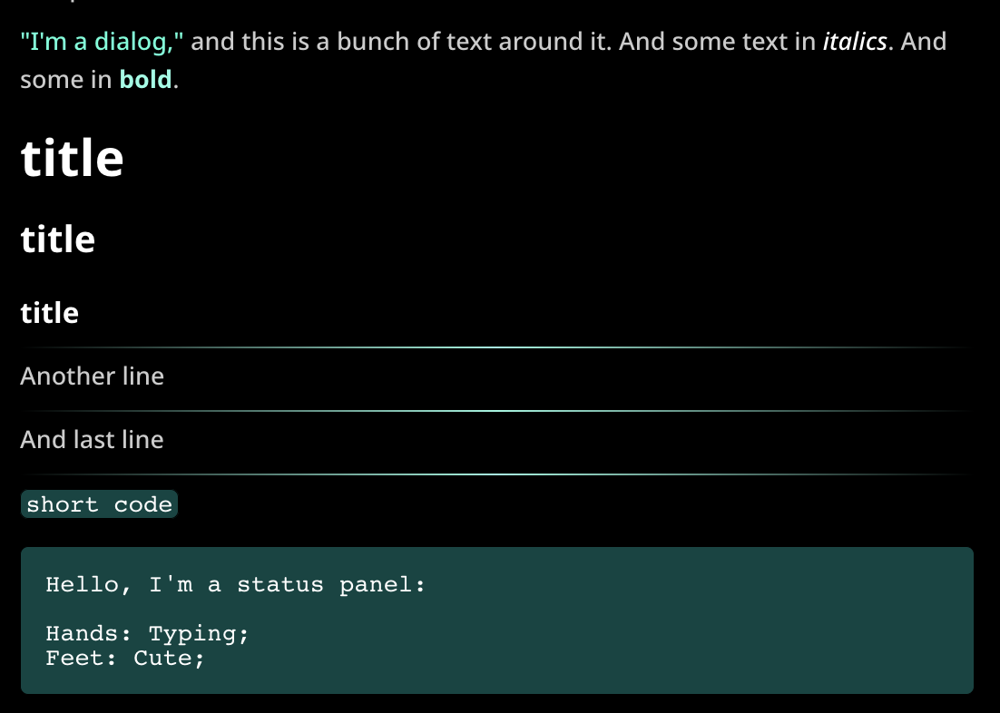

Personal modification in the CSS I did for SillyTavern:

 

## Full Theme

```
div.mes_text p { font: 11pt 'Lora'; color: #DBDBDB!important; text-align: justify; text-justify: inter-word;}
div.mes_text h1 { color: #ffffff !important;} 
div.mes_text h2 { color: #ffffff !important;} 
div.mes_text h3 { color: #ffffff !important;} 
div.mes_text strong { color: #89ffe5 !important;} 
div.mes_text em { color: #ffffff !important;} 
div.mes_text q { color: #4bffd8 !important;} 
div.mes_text hr { background-image: linear-gradient(90deg, var(--transparent), #90f8e1, var(--transparent)); } 
div.mes_text code { color: #ffffff !important; background: #004542 !important;} 
div.mes_text .hljs-bullet, .hljs-deletion, .hljs-name, .hljs-selector-tag, .hljs-template-variable, .hljs-variable, .hljs-attr, .hljs-link, .hljs-literal, .hljs-number, .hljs-symbol, .hljs-variable.constant_, .hljs-comment { color: #ffffff !important;} 
div.mes_text .hljs {color: #ffffff !important; background: #004542 !important;}
```

## Important bits

### Changing main text font and justifying it

Lora is installed on my system.

```
div.mes_text p { font: 11pt 'Lora'; color: #DBDBDB!important; text-align: justify; text-justify: inter-word;}
```

### Colored Bold

```
div.mes_text strong { color: #89ffe5 !important;} 
```

### Divider Fix

It was probably fixed by ST recently, but I was changing it so it matched the text:

```
div.mes_text hr { background-image: linear-gradient(90deg, var(--transparent), #90f8e1, var(--transparent)); } 
```

### Status Panel Stuff
Trying to make status panel without any formatting *without* using the plaintext tag.

```
div.mes_text code { color: #ffffff !important; background: #004542 !important;} 
div.mes_text .hljs-bullet, .hljs-deletion, .hljs-name, .hljs-selector-tag, .hljs-template-variable, .hljs-variable, .hljs-attr, .hljs-link, .hljs-literal, .hljs-number, .hljs-symbol, .hljs-variable.constant_, .hljs-comment { color: #ffffff !important;} 
div.mes_text .hljs {color: #ffffff !important; background: #004542 !important;}
```